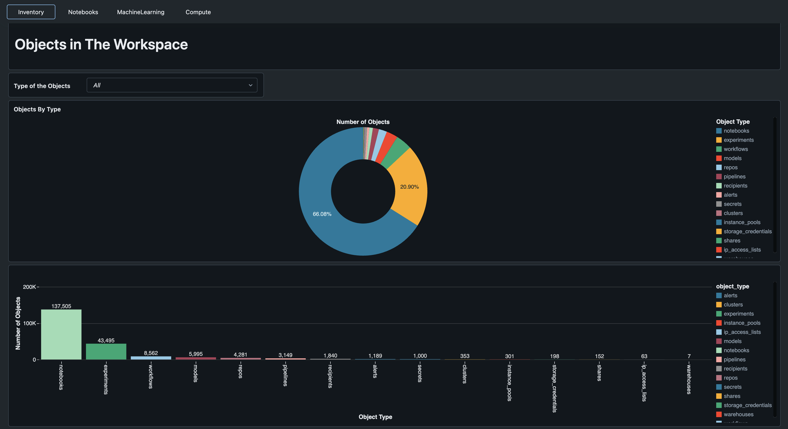
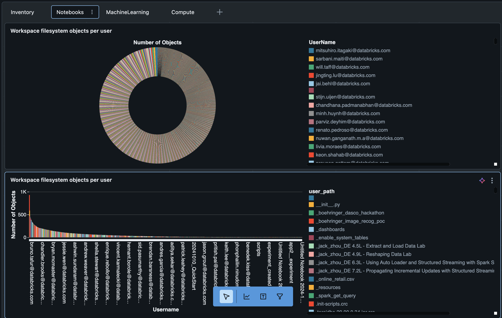
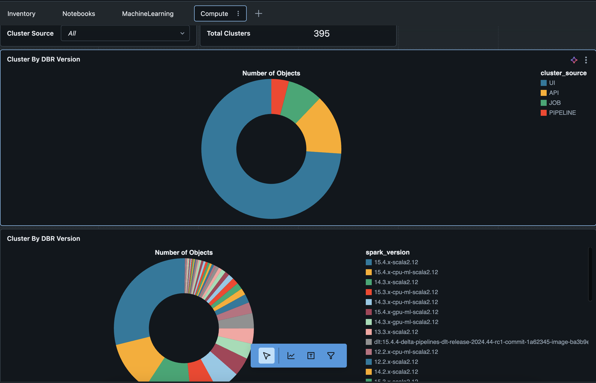
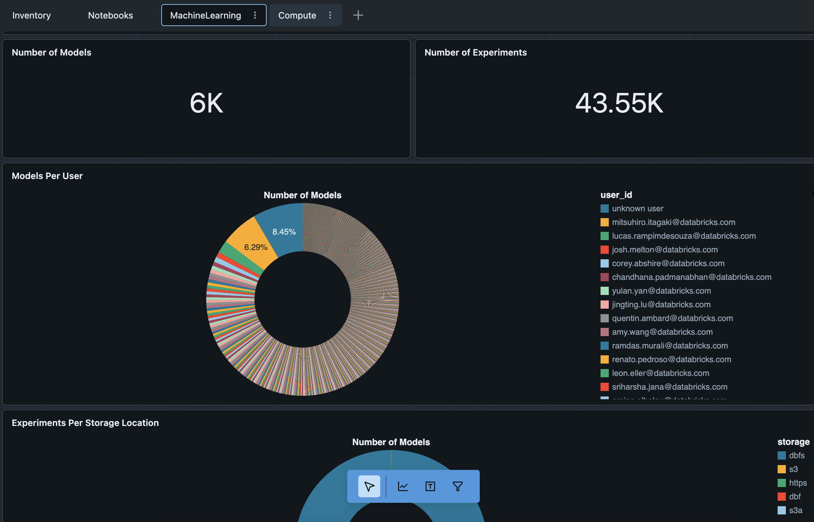

# Workspace_inventory






The 'workspace_inventory' project will scan a Databricks workspace and extract data of the objects in the workspace and save as delta tables, with this data it build a dashboard to provide an overview of all the objects in the workspace

## How does it work

* Create a schema where the data will be saved and replace accordingly in the file workspace_invetory_builder_job.yml to allow the workflows to find out where the data should be saved
* Install the tool in the workspace according to the get started session 
* Execute the workspace_inventory_builder workflow to collect the API data the time to finish this workflow may vary based on the number of objects available in the workspace typically around 30 min but it can take longer.
* Execute the workflow workspace_inventory_builder_create_view_dashboard it should create a view and a dashboard to display the data
* Visualize the data in the dashboard "Workspace Inventory"

## Getting started

1. Install the Databricks CLI from https://docs.databricks.com/dev-tools/cli/databricks-cli.html

2. Authenticate to your Databricks workspace, if you have not done so already:
    ```
    $ databricks configure
    ```

3. To deploy a development copy of this project, type:
    ```
    $ databricks bundle deploy --target dev
    ```
    (Note that "dev" is the default target, so the `--target` parameter
    is optional here.)

    This deploys everything that's defined for this project.
    For example, the default template would deploy a job called
    `[dev yourname] workspace_inventory_job` to your workspace.
    You can find that job by opening your workpace and clicking on **Workflows**.

4. Similarly, to deploy a production copy, type:
   ```
   $ databricks bundle deploy --target prod
   ```

   Note that the default job from the template has a schedule that runs every day
   (defined in resources/workspace_inventory.job.yml). The schedule
   is paused when deploying in development mode (see
   https://docs.databricks.com/dev-tools/bundles/deployment-modes.html).

5. To run a job or pipeline, use the "run" command:
   ```
   $ databricks bundle run
   ```

6. Optionally, install developer tools such as the Databricks extension for Visual Studio Code from
   https://docs.databricks.com/dev-tools/vscode-ext.html.

7. For documentation on the Databricks asset bundles format used
   for this project, and for CI/CD configuration, see
   https://docs.databricks.com/dev-tools/bundles/index.html.
